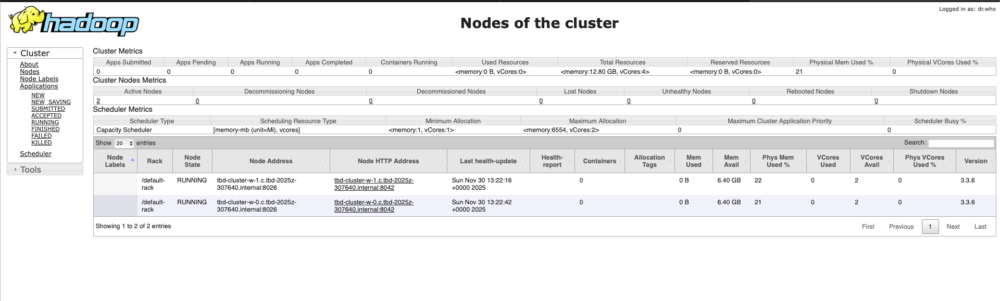
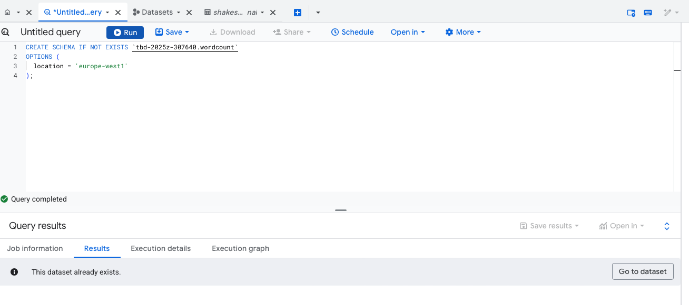
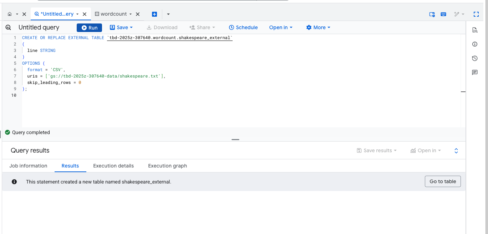
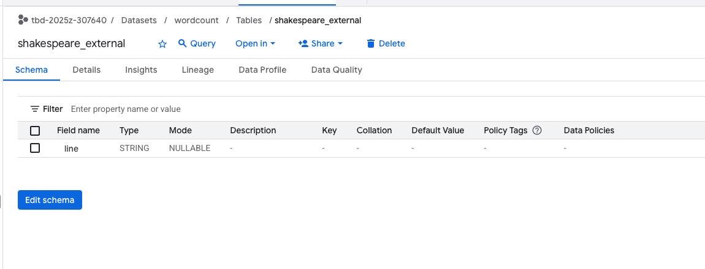
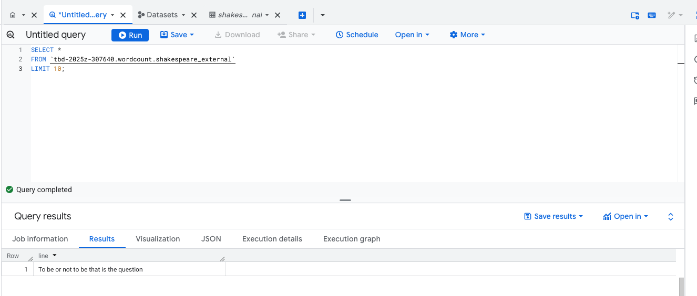
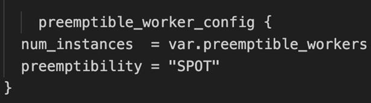

IMPORTANT ❗ ❗ ❗ Please remember to destroy all the resources after each work session. You can recreate infrastructure by creating new PR and merging it to master.
  


1. Authors:

   ***Group 9 2025Z***

   ***https://github.com/Cezym/tbd-workshop-1***
   
2. Follow all steps in README.md.

3. From avaialble Github Actions select and run destroy on main branch.
   
4. Create new git branch and:
    1. Modify tasks-phase1.md file.
    
    2. Create PR from this branch to **YOUR** master and merge it to make new release. 
    
    ***Screenshot from GA after succesfull application of release***
   


6. Analyze terraform code. Play with terraform plan, terraform graph to investigate different modules.

    ***describe one selected module and put the output of terraform graph for this module here***

    Moduł VPC to gotowy zestaw konfiguracji, który automatycznie tworzy całą sieć VPC w chmurze (w naszym przypadku w GCP) wraz z jej komponentami podsieciami, regułami firewall'a oraz innymi opcjonalnymi elementami jak np. routery i NAT. W module znajdują się dwa kluczowe zasoby:  
    - google_compute_firewall.default-internal-allow-all - reguła firewall, która pozwala na pełną komunikację wewnątrz VPC (host ↔ host)
    - google_compute_firewall.fw-allow-ingress-from-iap - reguła firewall pozwalająca na dostęp do zasobów poprzez Identity-Aware Proxy (IAP)

    

   
7. Reach YARN UI
   
   ***place the command you used for setting up the tunnel, the port and the screenshot of YARN UI here***

    ustawienie tunelu 
    ```gcloud compute ssh --project tbd-2025z-307640 --zone europe-west1-b tbd-dataproc-m -- -N -L 8088:localhost:8088```
 
    po ustawieniu tunelu, YARN UI jest widoczny w przeglądarce pod adresem:
http://localhost:8088

   

   
   
8. Draw an architecture diagram (e.g. in draw.io) that includes:
    1. Description of the components of service accounts
    2. List of buckets for disposal
    
    ***place your diagram here***

9. Create a new PR and add costs by entering the expected consumption into Infracost
For all the resources of type: `google_artifact_registry`, `google_storage_bucket`, `google_service_networking_connection`
create a sample usage profiles and add it to the Infracost task in CI/CD pipeline. Usage file [example](https://github.com/infracost/infracost/blob/master/infracost-usage-example.yml) 

   ***Expected consumption and screenshot from infracost output***
   

10. Create a BigQuery dataset and an external table using SQL
    
    ***place the code and output here***

   <!-- #```bash -->
   <!-- #echo "To be or not to be that is the question" > #shakespeare.txt -->
   <!-- ``` -->
   ```bash
   gsutil cp shakespeare.txt gs://tbd-2025z-307640-data/
   ```
   ```bash
    gsutil ls gs://tbd-2025z-307640-data/shakespeare.txt                                
   ```
   - stworzenie-datasetu

   
   
   - stworzenie tabeli 

   

   - widok tabeli w datasecie

   

   - query z tabeli 

   

   


    ***why does ORC not require a table schema?***

    Pliki ORC przechowują zarówno dane, jak i ich schemat (są "self-describing"). Dlatego w BigQuery nie trzeba definiować schematu przy tworzeniu tabeli zewnętrznej na plikach ORC.

11. Find and correct the error in spark-job.py

    ***describe the cause and how to find the error***

    Ścieżka do pliku bucket w spark-job.py była nieprawidłowa.

12. Add support for preemptible/spot instances in a Dataproc cluster

    ***place the link to the modified file and inserted terraform code***

    [variables.tf](modules/dataproc/variables.tf)

    

    [main.tf](modules/dataproc/main.tf)

    

    
    
13. Triggered Terraform Destroy on Schedule or After PR Merge. Goal: make sure we never forget to clean up resources and burn money.

Add a new GitHub Actions workflow that:
  1. runs terraform destroy -auto-approve
  2. triggers automatically:
   
   a) on a fixed schedule (e.g. every day at 20:00 UTC)
   
   b) when a PR is merged to main containing [CLEANUP] tag in title

Steps:
  1. Create file .github/workflows/auto-destroy.yml
  2. Configure it to authenticate and destroy Terraform resources
  3. Test the trigger (schedule or cleanup-tagged PR)
     
***paste workflow YAML here***

[auto-destroy.yml](github/workflows/auto-destroy.yml)

***paste screenshot/log snippet confirming the auto-destroy ran***

***write one sentence why scheduling cleanup helps in this workshop***

Harmonogram automatycznego zwalniania zasobów zapobiega niepotrzebnym kosztom i utrzymuje porządek w projekcie.
